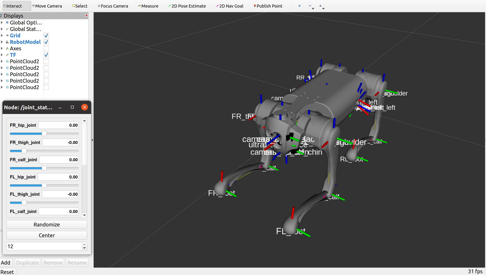
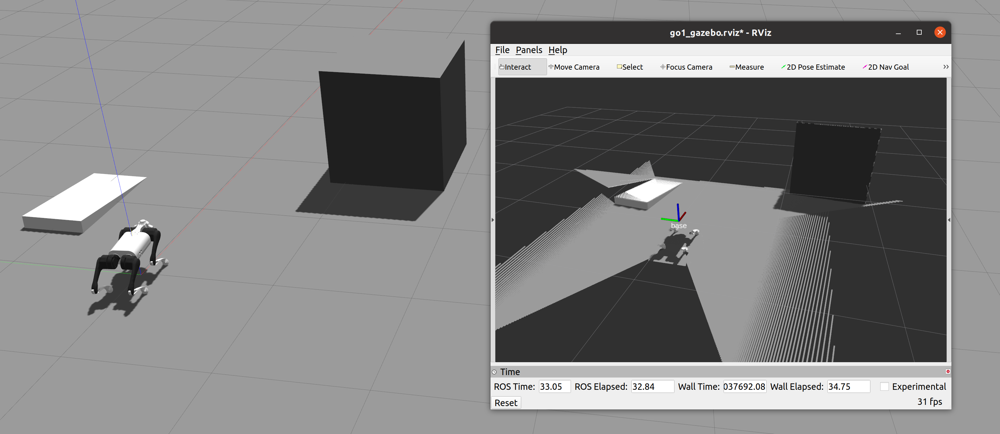

# Unitree Quadruped robot simulation - Python version (ROS2)

This repository contains all the files and codes needed to simulate the [go1](https://www.unitree.com/products/go1) quadrupedal robot using [Gazebo](http://gazebosim.org/) and [ROS](https://www.ros.org/).
The software runs on below envs

* [ROS2 humble](https://docs.ros.org/en/humble/index.html).

## Setup

* Install Additional Pkgs

```
# install
sudo apt install ros-humble-gazebo-ros-pkgs
# 查看ros版本
printenv ROS_DISTRO
# install
sudo apt install ros-humble-gazebo-ros-pkgs
# test (需要先source)
gazebo --verbose /opt/ros/humble/share/gazebo_plugins/worlds/gazebo_ros_diff_drive_demo.world
ros2 topic pub /demo/cmd_demo geometry_msgs/Twist '{linear: {x: 1.0}}' -1

# ros2 control
sudo apt install ros-humble-ros2-control
sudo apt install ros-humble-gazebo-ros2-control
sudo apt install ros-humble-ros2-controllers
sudo apt install ros-humble-twist-mux

# joint state
sudo apt install ros-humble-joint-state-publisher-gui
```

* Build Pkgs one by one (It's okay to use `colcon build` for build all)

```
colcon build --packages-select go1_description go1_gazebo go1_controller quadruped_unitree
```

## Execution

* Example 1 - Robot Description

See how quadruped robot constructed and control each joints.

```
ros2 launch go1_description go1_rviz_launch.py
```

<p align="center">
    
</p>

* Example 2 - Gazebo Execution

Walking quadruped robots within Gazebo Sim.

```
ros2 launch quadruped_unitree go1_gazebo_launch.py

# Sometimes it falls over and we need to raise them by below command
ros2 run quadruped_unitree respawn_robot.py

# Finally makes it walk!
ros2 run teleop_twist_keyboard teleop_twist_keyboard cmd_vel:=/key_vel
```

<p align="center">
    
</p>

---

## Future Work

- [ ] Template based leg control (Ground Reaction Force required)
- [ ] Reinforcement learning (Will be fun)
- [ ] Stairs Climbing
- [ ] Sensor Fusion and Tracking

## Credits
 - [a1_sim_py@lnotspotl](https://github.com/lnotspotl/a1_sim_py)
 - [spotMicro@mike4192](https://github.com/mike4192/spotMicro)
 - [Unitree Robotics](https://github.com/unitreerobotics/a1_ros)
 - [QUADRUPED ROBOTICS](https://quadruped.de)
 - [a1_sim_py@kimsooyoung](https://github.com/kimsooyoung/a1_sim_py)
